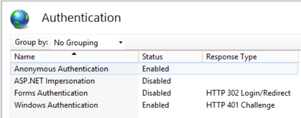

# Terminal.Backend.Kestrel

Dit is de backend die het mogelijk maakt een terminal applicatie op de achtergrond te draaien, hiervan de output te
lezen en input aan door te geven. Doormiddel van SignalR kan deze backend aangesproken worden. De backend kan worden
gestart via IIS. Authenticatie en authoristatie verloopt
via [Windows Authentication](https://docs.microsoft.com/en-us/aspnet/core/security/authentication/windowsauth?view=aspnetcore-5.0&tabs=visual-studio#httpsys)
en werkt dus alleen op een Windows Server.

## Installatie

Bouw het project en publiceer deze naar een map op de Windows Server.

Maak vervolgens een nieuwe site aan in IIS en wijs naar de locatie van de map waar de applicatie in staat.

Voeg bindings toe voor HTTP en HTTPS.

De applicatie maakt gebruik van Windows Authentication en dit moet worden aangezet onder de **Authentication**
instellingen in IIS.



**Anonymous Authentication** moet ook aanstaan. Dit is namelijk nodig om de SignalR verbindingen te kunnen starten.

Test de applicatie door naar https://localhost/terminal te gaan op de server of naar https://{ip van server}/terminal
vanaf een computer die toegang heeft tot de server. Bij juiste werking wordt gevraagd om in te loggen met een Windows
account. Wanneer je dit doet, moet je een pagina te zien krijgen met **Connection ID required**.

## Configuratie

Met welke console applicatie er verbinding moet worden gemaakt, kan worden ingesteld in de **appsettings.json** file.
Optioneel kunnen er start argumenten aan toegevoegd worden. `PseudoConsoleType` geeft aan welke methode gebruikt wordt
om met de console applicatie te verbinden. Zie het project `Terminal.Pty` voor meer uitleg over welke methodes er
beschikbaar zijn en hoe deze werken.

```json
"Terminal": {
"PseudoConsoleType": "{methode waarmee verbonden wordt met de console applicatie}",
"Directory": "C:\\{pad naar hoofdmap van terminal applicatie}",
"Executable": "Terminal.exe",
"Arguments": ""
}
```

Zorg ervoor dat de backend toegang heeft tot de locatie van de console applicatie, of plaats deze in dezelfde map als de
backend.

Om het probleem met CORS op te lossen moet in de **appsettings.json** file de domeinnaam van de server waar de frontend
op draait worden opgegeven (zonder http(s)://).

```json
"ServerURL" : "windows-server"
```

Authenticatie gebeurd op basis van Active Directory groepen. In de `appsettings` moet worden aangegeven tot welke groep
gebruikers moeten behoren om toegang te krijgen tot de endpoints. Dit kan een standaard groep zijn zoals `Users`
of `Administrators`, of een zelf toegevoegde groep.

## Werking

In principe kan de backend overweg met de meeste console applicaties. De backend start de console applicatie op,
luistert naar output en stuurt dit met SignalR door naar clients. Daarnaast biedt de backend een endpoint om input te
geven aan een console applicatie.

Bij een .NET Console applicatie kan de output flow als volgt simpel worden weergegeven...

**Console.WriteLine()** -> **Backend** -> **SignalR Hub** -> **Client**

...en bij input...

**Client** -> **SignalR Hub** -> **Backend** -> **Console.ReadLine()**
