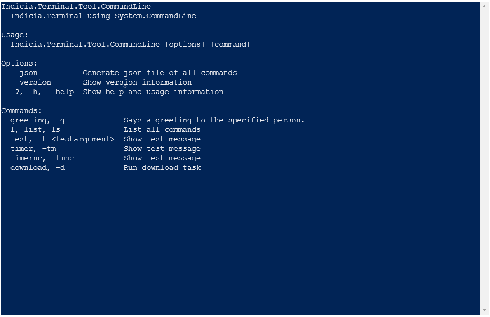
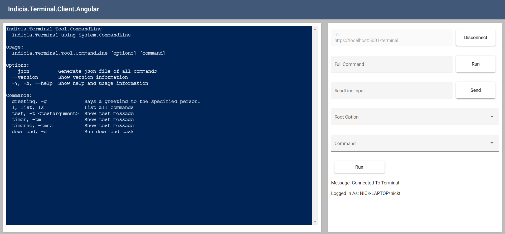
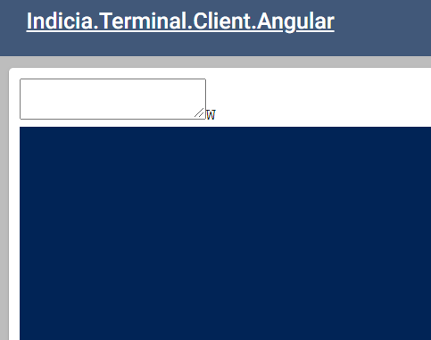

# Terminal.Frontend

JavaScript/TypeScript library die het mogelijk maakt via SignalR verbinding te maken met een backend die een terminal
opensteld. Bevat de onderdelen voor het maken van een verbinding en voor het weergeven van een terminal in een
webapplicatie.

Deze library is afhankelijk van [xterm](https://www.npmjs.com/package/xterm) voor de terminal UI
en [@microsoft/signalr](https://www.npmjs.com/package/@microsoft/signalr) voor real-time communicatie met een backend.

## Installatie

Deze package staat in een private repository op GitLab. Om de package te kunnen installeren moet
aan [npm](https://www.npmjs.com/) worden doorgegeven waar deze zich bevindt. Dit kan door een **.npmrc** bestand toe te
voegen in de hoofdmap van het project en de volgende regel hierin te zetten:

```
@nick.thijssen:registry=https://git.nl/api/v4/projects/637/packages/npm/
```

Voeg hierna de package toe aan het project:

```powershell
npm install @nick.thijssen/frontend 
```

Het terminal venster kan worden toegevoegd aan een webpagina door deze te binden aan een `HTMLElement` zoals een `<div>`
. Voeg een `div` toe en geef deze een id zoals hieronder (hoeft niet **terminal-container** te zijn).

```html
<!DOCTYPE html>
<html>
<head>
    <title>Terminal.Client</title>
    <meta charset="UTF-8"/>
    <link rel="stylesheet" href="node_modules/@nick.thijssen/frontend/css/terminal.css"/>
</head>
<body>
<div id="terminal-container"></div>
<script src="src/index.js"></script>
</body>
</html>
```

Voeg vervolgens via JavaScript de code toe om de terminal te binden aan deze `div`. Geef ook de URL op van de SignalR
endpoint waar de terminal mee moet verbinden en start de terminal.

```js
import {ServerTerminal} from "@nick.thijssen/frontend";

function start() {
    const container = document.getElementById('terminal-container');
    const serverTerminal = new ServerTerminal(container, "https://localhost:5001/terminal");
    serverTerminal.start();
}

start();
```

Deze package bevat een CSS file die nodig is om het terminal venster juist weer te kunnen geven. Deze dient handmatig
toegevoegd te worden aan HTML zoals in het voorbeeld hierboven of op een andere manier afhankelijk van het type project.
In een [Angular](https://angular.io/) project kan dit bijvoorbeeld in het bestand **angular.json** onder `styles`.

```json
"styles": [
"src/styles.css",
"./node_modules/@nick.thijssen/frontend/css/terminal.css"
],
```

Als alles juist is ingesteld zou er op de plek van de aangegeven `div` een terminal venster moeten worden weergegeven
zoals in onderstaande afbeelding.


## Functies

Deze library is speciaal gemaakt en afgestemd om te werken met het **Terminal.Backend** project. Naast het weergeven van
een terminal venster, bevat het standaard functies om met het backend project te kunnen communiceren door middel van
SignalR. SignalR communicatie loopt door middel van berichten met een naam en optioneel een inhoud. De backend verstuurt
bijvoorbeeld berichten met de naam `ReceiveTerminalOutput` met als inhoud de output die moet worden weergegeven in het
terminal venster. Client's kunnen berichten sturen naar de backend met de naam `SendRunCommand` met daarin de argumenten
waarmee de terminal moet worden uitgevoerd.

Op dit moment bevat deze library vier standaard functies voor ontvangen berichten, namelijk:

1. Voor het ontvangen en weergeven van terminal output.
2. Voor het ontvangen van iemands username.
3. Voor het ontvangen van een JSON bestand waarin de beschikbare commands en hun gebruik wordt beschreven.
4. Voor het ontvangen van een reset bericht vanuit de backend.

en drie functies voor het versturen van berichten:

1. Versturen van de argumenten waarmee een nieuwe terminal moet worden opgestart.
2. Versturen van input naar de terminal. Hiermee kan bijvoorbeeld `y` of `n` worden ingevoerd wanneer de terminal hierom
   vraagt.
3. Het versturen van een verzoek om het JSON bestand op te halen met de beschikbare commands.

Het project **Terminal.Client.Angular** dient als voorbeeld voor alle mogelijke functies die deze library biedt.



Aan deze library zijn een aantal functies toegevoegd die [xterm](https://www.npmjs.com/package/xterm)
en [@microsoft/signalr](https://www.npmjs.com/package/@microsoft/signalr) niet hebben of standaard niet aan hebben
staan, namelijk:

- **Auto-resize**: Een standaard XTerm.js terminal heeft een vaste default grootte (aantal kolommen en rijen). De
  terminal in deze library past zijn hoogte en breedte aan op basis van welke ruimte er maximaal beschikbaar is in het
  parentelement en wijzigt dynamisch mee.
- **Afhandelen van dis/reconnects**: Er zijn functies toegevoegd aan de terminal en de SignalR socket om wijzigingen in
  de verbinging beter af te handelen en af te stemmen. De socket geeft de status van de verbinding en bijbehorende
  berichten door aan de terminal waarop deze kan reageren. Zonder verbinding accepteert het venster bijvoorbeeld geen
  input. Autoreconnect staat nu standaard aan.
- **JSON omzetten naar objecten**: Het backend project kan een bericht sturen waarin alle mogelijke commands en hun
  gebruik in JSON omschreven staan. Deze library kan dit omzetten naar specifieke klassen en onthoud deze. Dit kan
  gebruikt worden om een UI te genereren zoals in het Angular project, of voor zoiets als auto-complete.
- **Authenticatie support**: Support voor authenticatie staat standaard aan, aangezien dit vereist is voor de backend.
  Username kan worden opgevraagd en onthouden.
- **Input via venster**: Het XTerm.js terminal venster is achter de schermen eigenlijke een gewone HTML `textarea`. Elk
  karakter wat in het venster wordt getypt, wordt gelijk doorgestuurd naar de backend omdat deze nu gelinked is aan de
  functie `SendCommandlineInput`. De backend is verantwoordelijk voor het weergeven van deze input door deze wel of niet
  terug te sturen.

## Opmerkingen

Hieronder een lijst met enkele problemen die kunnen voorkomen, wat de oorzaak ervan kan zijn en mogelijke oplossingen.

- **Input via venster wordt niet weergegeven**: Het terminal venster is eigenlijk een `textarea` met styling. De
  klasse `Terminal` uit XTerm.js heeft een aantal methodes, namelijk `onData()`, `onKey()` en `onBinary` die luisteren
  naar toetsaanslagen in dit venster. Daarnaast heeft `Terminal` een methode `write(data: string)` waarmee tekst wordt
  geprint naar het venster. In deze library wordt in de methode `onData()` de methode `SendCommandlineInput()`
  aangesproken. Toetstaanslagen worden dus verstuurd naar de backend, maar niet rechtstreeks geprint in het venster. De
  backend zal bepalen of de input moet worden weergegeven door deze terug te sturen met een `ReceiveTerminalOutput`
  bericht. Bij ontvangst van dit bericht wordt de inhoud via `write()` weergeven in het venster. Omdat dit allemaal vrij
  snel kan gaan, lijkt het alsof er rechtstreeks input gegeven kan worden aan het venster, terwijl dit in werkelijkheid
  een hele keten is. Enkele oorzaken waarom input niet lijkt te werken, terwijl dit wel verwacht wordt zijn:
    - Er is geen verbinding met de backend. Input via het venster kan worden in- en uitgeschakeld door middel
      van`Terminal.setOption('disableStdin', true/false)`. In het geval van deze library, gebeurt dit op basis van de
      verbindingsstatus.
    - Er wordt geen input gevraagd door de console applicatie. Data die via `SendCommandlineInput` wordt verstuurt,
      wordt door de backend doorgegeven aan de console applicatie. Deze zal er echter alleen iets mee doen in het geval
      van een `Readline()` of `Readkey()`. Check of het command in de console applicatie ook daadwerkelijk wacht op
      input.
- **Terminal venster ziet er als volgt uit**:

  

  Dit is het geval wanneer het CSS bestand mist, niet geladen kan worden of niet is toegevoegd. Zorg dat het CSS bestand
  uit deze library is toegevoegd aan de applicatie en juist geladen worden.
