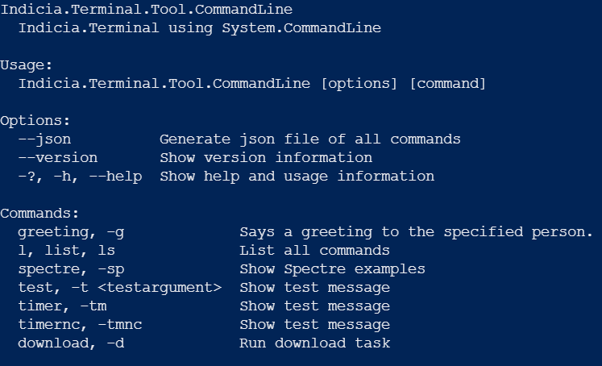
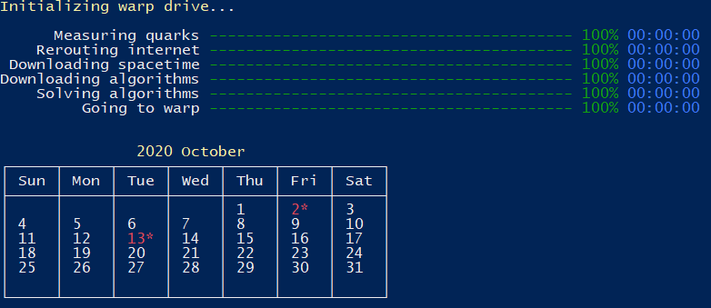
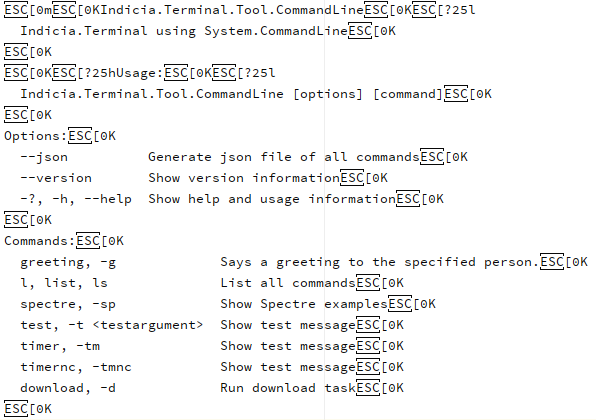

# Terminal.PTY

Dit project bevat de functionaliteit om een console applicatie op te starten, de output hiervan te lezen en input er
naartoe te schrijven vanuit een andere applicatie. Samen met **Terminal.Connector** is dit de .NET versie
van [Node-PTY](https://github.com/microsoft/node-pty).

Code is gebaseerd op voorbeeld projecten uit het [Microsoft Terminal](https://github.com/microsoft/terminal) project,
specifiek [GUIConsole.ConPTY](https://github.com/microsoft/terminal/tree/main/samples/ConPTY/GUIConsole/GUIConsole.ConPTY)
.

## Globale Werking

Er kan op drie manieren verbonden worden met een console applicatie. De methodes verschillen in hoevere en op welke
manier ze de output kunnen uitlezen en op welke Windows versies ze worden ondersteund, maar globaal werken zij ongeveer
hetzelfde.

Het **Terminal.Backend** project gebruikt bijvoorbeeld dit project om de **Terminal.Tool.CommandLine**
terminal applicatie op te starten en ermee te verbinden. De console applicatie wordt als los process opgestart (alleen
via ConPty en WinPty, niet via Process). Dit zorgt ervoor dat de console applicatie en de backend applicatie,
daadwerkelijk los van elkaar draaien. Wanneer de backend wordt afgesloten terwijl de console applicatie nog draait (of
andersom), dan heeft dit geen gevolgen voor de ander. De backend kan asynchroon de output van de console applicatie
uitlezen en input er aan doorgeven.

## Terminal Input en Output

Om beter te kunnen begrijpen waar dit project precies voor dient en waarom er drie verschillende implemenaties gebruikt
kunnen worden, moet kort uitgelegd worden wat terminal input en output eigenlijk is. In onderstaande afbeelding is de
output te zien van de **Terminal.Tool.CommandLine**
applicatie wanneer deze wordt gestart met PowerShell zonder argumenten:

Op het eerste gezicht lijkt dit gewoon te bestaan uit tekst met een aantal Enters en Tabs. De applicatie heeft echter
ook commands die veel uitgebreidere output geven zoals het `spectre` command:

Dit command geeft output weer in verschillende kleuren en kan daarnaast bestaande output updaten. Dit is mogelijk door
middel van [ANSI Escape Codes](https://en.wikipedia.org/wiki/ANSI_escape_code). Met deze codes kunnen acties worden
uitgevoerd op een terminal zoals het verplaatsen van de cursor en het veranderen van kleuren. Ook Enters, Tabs of
bijvoorbeeld Backspace hebben een specifieke code. De codes bevinden zich in de output. De ruwe output van het eerste
voorbeeld ziet er bijvoorbeeld zo uit:

De library [xterm](https://www.npmjs.com/package/xterm) die wordt gebruikt in de frontend, kan omgaan met ANSI Escape
Codes, maar hiervoor moeten deze dus wel uitgelezen worden uit de console applicatie. De ConPty en WinPty implementaties
maken dit mogelijk.

## WinPty

De [WinPty](https://github.com/rprichard/winpty) methode wordt op dit moment aangeraden aangezien deze op de meeste
versies van Windows werkt en ANSI Escape Codes ondersteund. WinPty start de console applicatie op in een apart process,
namelijk `winpty-agent.exe`. Vervolgens loopt communicatie via dit process.

## ConPty

[ConPty](https://github.com/Microsoft/Terminal) is een nieuwe methode die recent is ontwikkeld door Microsoft. ConPty
bied dezelfde functionaliteit als WinPty, maar werkt op dit moment alleen op Windows 10 versie 1903 of nieuwer. In de
toekomst wordt aangeraden om deze methode te gebruiken aangezien hij vanaf nu wordt meegeleverd met Windows. Wel moet in
de gaten gehouden worden of ConPty ook standaard wordt geleverd met Windows Server, dit is nu namelijk niet het geval.

## ProcessPty

Deze methode maakt gebruik van de `Process` klasse van .NET. Het is de simpelste implementatie, maar ondersteund alleen
basis input en output. Wanneer deze methode gebruikt wordt, kan niet de ruwe output, inclusief de escape codes, van een
console applicatie uitgelezen worden zoals dat met WinPty en ConPty wel kan. Alleen de geïnterpreteerde output kan
uitgelezen worden. Daarnaast draait de console applicatie niet als los process. Deze methode is bedoeld als voorbeeld en
wordt afgeraden om te gebruiken.

## Installatie

`ConPtyTerminal`, `WinPtyTerminal` en `ProcessPtyTerminal` implementeren alle drie de interface `ITerminal`. Via deze
interface kan een console applicatie worden opgestart, output worden gelezen en input worden gegeven.

Om `ConPty` te kunnen gebruiken is minimaal Windows 10 versie 1903 nodig.

Dit project bevat de laatste versie van `WinPty`. Om `WinPty` systeembreed te kunnen gebruiken, wordt aangeraden de
bestanden `winpty.dll`, `winpty-agent.exe` en `winpty-debugserver.exe` te kopiëren naar `C:\Windows\System32`.

Op oude versies van Windows zoals Windows 7 of Windows Server 2012, bestaat er de mogelijkheid ANSI support toe te
voegen aan CMD en PowerShell. Dit kan door middel van het installeren van [ANSICON](https://github.com/adoxa/ansicon).
